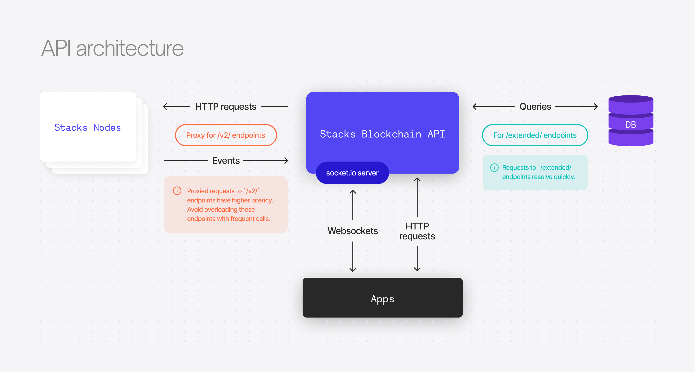

# @hirosystems/stacks-blockchain-api

[](https://github.com/hirosystems/stacks-blockchain-api/actions/workflows/ci.yml)
[](https://github.com/hirosystems/stacks-blockchain-api/releases/latest)
[](https://hub.docker.com/r/hirosystems/stacks-blockchain-api/)
[](https://www.npmjs.org/package/@stacks/blockchain-api-client)

## Quick start

### Local

This service requires `postgres`, `stacks-node`, `bitcoind`, and a few other components in order to run.
The [`clarinet`](https://github.com/hirosystems/clarinet) project provides an easy way to spin up the API and all these services:
> clarinet devnet - a local standalone development environment that simulates Bitcoin, Stacks node and other helpful components, similar to a staging environment.

Get started at https://docs.hiro.so/clarinet/getting-started

### Production

The docker image `hirosystems/stacks-blockchain-api` is recommended when running the API in a mainnet or testnet environment.

Note that this image cannot be ran standalone. Other services need to be configured correctly and running. For more information see https://docs.hiro.so/stacks-blockchain-api/how-to-guides/how-to-run-api-node


## Development quick start

First, ensure Docker is installed on your machine.

Clone repo and install dependencies with `npm install`.

VSCode is recommended for development. Pre-configured "run and debug" configurations are included. Run using `Launch: w/ postgres`.

Alternatively, use the command `npm run dev:integrated` -- this command will concurrently start the API server app and the service dependencies.

Check to see if the server started successfully by visiting http://localhost:3999/extended/v1/status

## Local Development

To run the server, run `npm run dev:integrated`, which uses docker-compose to deploy the service dependencies (e.g., PostgreSQL, Stacks core node, etc.).

You'll have a server on port 3999.

# Architecture



See [overview.md](overview.md) for architecture details.

# Deployment

We recommend running the API database on PostgreSQL version 14 or newer for optimal performance.

## Upgrading

If upgrading the API to a new major version (e.g., `3.0.0` to `4.0.0`), then the Postgres database from the previous version will likely be incompatible, and the process will fail to start. However, in some cases, the major versions are for client library changes (which are synced with the api version number). Check the changelog if you're unclear.

[Event Replay](#event-replay) must be used when upgrading major versions. Follow the event replay [instructions](#event-replay-instructions) below. Failure to do so will require wiping the Stacks Blockchain chain state data and the API Postgres database and re-syncing from scratch.

## API Run Modes

The API supports a series of run modes, each accommodating different use cases for scaling and data access by toggling [architecture](#architecture) components on or off, depending on its objective.

### Default mode (Read-write)

The default mode runs with all components enabled. It consumes events from a Stacks node, writes them to a Postgres database, and serves API endpoints.

### Write-only mode

During Write-only mode, the API only runs the Stacks node events server to populate the Postgres database, but it does not serve any API endpoints.

This mode is very useful when you need to consume blockchain data from the Postgres database directly, and you're not interested in taking on the overhead of running an API web server.

For write-only mode, set the environment variable `STACKS_API_MODE=writeonly`.

### Read-only mode

During Read-only mode, the API runs without an internal event server that listens to events from a Stacks node.
The API only reads data from the connected Postgres database when building endpoint responses.
In order to keep serving updated blockchain data, this mode requires the presence of another API instance that keeps writing stacks-node events to the same database.

This mode is very useful when building an environment that load-balances incoming HTTP requests between multiple API instances that can be scaled up and down quickly.
Read-only instances support WebSockets and socket.io clients.

For read-only mode, set the environment variable `STACKS_API_MODE=readonly`.

### Offline mode

In Offline mode, the app runs without a stacks-node or Postgres connection. In this mode, only the given rosetta endpoints are supported:
https://www.rosetta-api.org/docs/node_deployment.html#offline-mode-endpoints.

For running offline mode, set an environment variable `STACKS_API_MODE=offline`

## Event Replay

The stacks-node is only able to emit events live as they happen. This poses a problem in the
scenario where the stacks-blockchain-API needs to be upgraded, and its database cannot be migrated to
a new schema. One way to handle this upgrade is to wipe the stacks-blockchain-api's database and
stacks-node working directory and re-sync from scratch.

Alternatively, an event-replay feature is available where the API records the HTTP POST requests
from the stacks-node event emitter, then streams these events back to itself. Essentially simulating
a wipe & full re-sync, but much quicker.

The feature can be used via program args. For example, if there are breaking changes in the APIs
SQL schema, like adding a new column that requires events to be re-played, the following steps
could be run:

### Event Replay V2

This version of the replay process relies on parquet files processing instead of TSV files.

There are some improvements on the replay process and this version is is, around, 10x times faster than the previous (V1) one.

__Note: the previous event-replay version is still available and can be used as well, for the same purpose.__

#### Instructions

To run the new event-replay, please follow the instructions at [stacks-event-replay](https://github.com/hirosystems/stacks-event-replay#installation) repository.

### Event Replay V1

#### Instructions

##### V1 BNS Data

**Optional but recommended** - If you want the V1 BNS data, there are going to be a few extra steps:

1. Download BNS data:
   ```shell
   curl -L https://storage.googleapis.com/blockstack-v1-migration-data/export-data.tar.gz -o /stacks-node/bns/export-data.tar.gz
   ```
1. Extract it:
   ```shell
   tar -xzvf ./bns/export-data.tar.gz -C /stacks-node/bns/
   ```
1. Each file in `./bns` will have a corresponding `sha256` value. To Verify, run a script like the
   following to check the sha256sum:

    ```bash
    for file in `ls /stacks-node/bns/* | grep -v sha256 | grep -v .tar.gz`; do
        if [ $(sha256sum $file | awk {'print $1'}) == $(cat ${file}.sha256 ) ]; then
            echo "sha256 Matched $file"
        else
            echo "sha256 Mismatch $file"
        fi
    done
    ```
1. Set the data's location as the value of `BNS_IMPORT_DIR` in your `.env` file.

##### Export and Import

1. Ensure the API process is not running. When stopping the API, let the process exit gracefully so
   that any in-progress SQL writes can finish.
1. Export event data to disk with the `export-events` command:

   ```shell
   node ./lib/index.js export-events --file /tmp/stacks-node-events.tsv
   ```
1. Update to the new stacks-blockchain-api version.
1. Perform the event playback using the `import-events` command:

   **WARNING**: This will **drop _all_ tables** from the configured Postgres database, including any
   tables not automatically added by the API.

   ```shell
   node ./lib/index.js import-events --file /tmp/stacks-node-events.tsv --wipe-db --force
   ```

   This command has two modes of operation, specified by the `--mode` option:
   * `archival` (default): The process will import and ingest *all* blockchain events that have
     happened since the first block.
   * `pruned`: The import process will ignore some prunable events (mempool, microblocks) until the
     import block height has reached `chain tip - 256` blocks. This saves considerable
     time during import but sacrifices some historical data. You can use this mode if you're mostly
     interested in running an API that prioritizes real-time information.

## Bugs and feature requests

If you encounter a bug or have a feature request, we encourage you to follow the steps below:

 1. **Search for existing issues:** Before submitting a new issue, please search [existing and closed issues](../../issues) to check if a similar problem or feature request has already been reported.
 1. **Open a new issue:** If it hasn't been addressed, please [open a new issue](../../issues/new/choose). Choose the appropriate issue template and provide as much detail as possible, including steps to reproduce the bug or a clear description of the requested feature.
 1. **Evaluation SLA:** Our team reads and evaluates all the issues and pull requests. We are available Monday to Friday and make our best effort to respond within 7 business days.

Please **do not** use the issue tracker for personal support requests or to ask for the status of a transaction. You'll find help at the [#support Discord channel](https://discord.gg/SK3DxdsP).

## Contribute

Development of this product happens in the open on GitHub, and we are grateful to the community for contributing bug fixes and improvements. Read below to learn how you can take part in improving the product.

### Code of Conduct
Please read our [Code of Conduct](../../../.github/blob/main/CODE_OF_CONDUCT.md) since we expect project participants to adhere to it.

### Contributing Guide

Hiro welcomes all contributions to Hiro documentation. These contributions come in two forms: issues and pull requests.

#### Issues

Bugs, feature requests, and development-related questions should be directed to our [GitHub issues tracker](https://github.com/hirosystems/stacks-blockchain-api/issues/new).

If reporting a bug, try to provide as much context as possible and anything else that might be relevant to the describe the issue.  If possible include a simple test case that we can use to reproduce the problem on our own.

For feature requests, please explain what you're trying to do, and how the requested feature would be a complement to the project.

The two most important pieces of information we need in order to properly evaluate an issue or a feature request is a clear description of the behavior being reported.

#### Pull requests

A pull request allows anyone to suggest changes to a repository on GitHub that can be easily reviewed by others. Once a pull request is opened, you can discuss and review the potential changes with collaborators and add follow-up commits before your changes are merged into the base branch.

Keep in mind that pull requests are not merged directly into the `master` branch. It must have `develop` as the base branch.

### Community

Join our community and stay connected with the latest updates and discussions:

- [Join our Discord community chat](https://discord.gg/ZQR6cyZC) to engage with other users, ask questions, and participate in discussions.

- [Visit hiro.so](https://www.hiro.so/) for updates and subcribing to the mailing list.

- Follow [Hiro on Twitter.](https://twitter.com/hirosystems)


## Client library

You can use the Stacks Blockchain API Client library if you need to call the API via JavaScript or receive real-time updates via WebSockets or Socket.io. Learn more [here](client/README.md).
