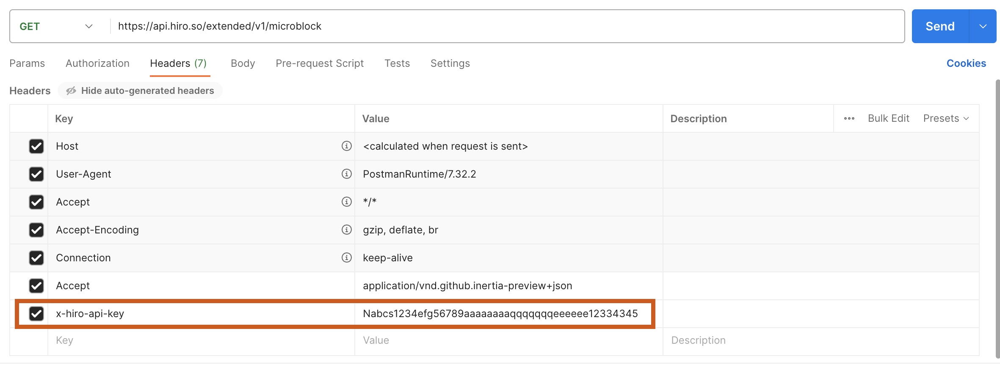

API keys are alpha-numeric string values distributed to the developer customers to grant access to your API.

# Steps to use API Key

This guide helps you with the steps to use the API key to interact with the Stacks Blockchain API.

:::note

_The API key is passed in the **header** of your API call._

:::

There are multiple ways to interact with the endpoint. However, this document walks you through three ways to make an [API call](https://docs.hiro.so/api#tag/Microblocks/operation/get_microblock_list). You can choose between any of the following methods.

- Curl
- Postman
- Typescript function

## Using Curl

Using Curl, you will pass the API key in an `x-hiro-api-key` header. Use the following command as an example to call the API endpoint `https://api.hiro.so/extended/v1/microblock`.

`curl https://api.hiro.so/extended/v1/microblock -H 'x-hiro-api-key: Nabcs1234efg56789aaaaaaaaqqqqqqqeeeeee12334345'`

## Using Postman

The following section walks you through using an API key with [Postman](https://www.postman.com/).

In the Postman request, add the [API endpoint](https://api.hiro.so/extended/v1/microblock) with the `Get` request. Then, add the API key and its value received from the Hiro team in the **Headers** section, as shown in the image below.

Select **Send** to get recent microblocks.



## Using the Typescript function

```typescript
function getRecentMicroblocks(apiKey: string) {
  const url = `https://api.hiro.so/extended/v1/microblock`;
  const headers = new Headers();
  headers.append("x-hiro-api-key", ${apiKey});

  return fetch(url, {
    headers: headers
  })
    .then(response => response.json());
}
```
