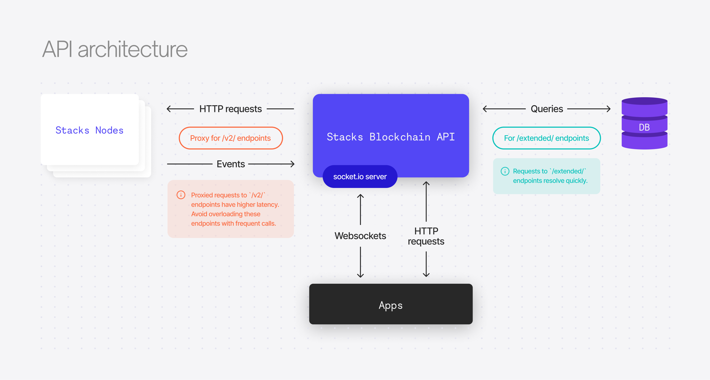

# @hirosystems/stacks-blockchain-api

[](https://github.com/hirosystems/stacks-blockchain-api/actions/workflows/ci.yml)
[](https://github.com/hirosystems/stacks-blockchain-api/releases/latest)
[](https://hub.docker.com/r/hirosystems/stacks-blockchain-api-standalone/)
[](https://www.npmjs.org/package/@stacks/blockchain-api-client)

## Quick start

A self-contained Docker image is provided which starts a Stacks 2.05 blockchain and API instance.

Ensure Docker is installed, then run the command:

```shell
docker run -p 3999:3999 hirosystems/stacks-blockchain-api-standalone
```

Similarly, a "mocknet" instance can be started. This runs a local node, isolated from the testnet/mainnet:

```shell
docker run -p 3999:3999 -e STACKS_NETWORK=mocknet hirosystems/stacks-blockchain-api-standalone
```

Once the blockchain has synced with network, the API will be available at:
[http://localhost:3999](http://localhost:3999)

## Development quick start

First, ensure Docker is installed on your machine.

Clone repo and install dependencies with `npm install`.

Run `npm run dev:integrated`.

This command will concurrently start the API server app and the service dependencies.

Check to see if the server started successfully by visiting http://localhost:3999/extended/v1/status

## Local Development

### Setup Services

Then run `npm run devenv:deploy` which uses docker-compose to deploy the service dependencies (e.g. PostgreSQL, Stacks core node, etc).

### Running the server

To run the server in 'watch' mode (restart for every code change), run `npm run dev:watch`. You'll have a server on port 3999.

# Architecture



See [overview.md](overview.md) for architecture details.

# Deployment

For optimal performance, we recommend running the API database on PostgreSQL version 14 or newer.

## Upgrading

If upgrading the API to a new major version (e.g. `3.0.0` to `4.0.0`) then the Postgres database from the previous version will not be compatible and the process will fail to start.

[Event Replay](#event-replay) must be used when upgrading major versions. Follow the event replay [instructions](#event-replay-instructions) below. Failure to do so will require wiping both the Stacks Blockchain chainstate data and the API Postgres database, and re-syncing from scratch.

## API Run Modes

The API supports a series of run modes, each accommodating different use cases for scaling and data access by toggling [architecture](#architecture) components on or off depending on its objective.

### Default mode (Read-write)

The default mode runs with all components enabled. It consumes events from a Stacks node, writes them to a postgres database, and serves API endpoints.

### Write-only mode

During Write-only mode, the API only runs the Stacks node events server to populate the postgres database but it does not serve any API endpoints.

This mode is very useful when you need to consume blockchain data from the postgres database directly and you're not interested in taking on the overhead of running an API web server.

For write-only mode, set the environment variable `STACKS_API_MODE=writeonly`.

### Read-only mode

During Read-only mode, the API runs without an internal event server that listens to events from a Stacks node.
The API only reads data from the connected postgres database when building endpoint responses.
In order to keep serving updated blockchain data, this mode requires the presence of another API instance that keeps writing stacks-node events to the same database.

This mode is very useful when building an environment that load-balances incoming HTTP requests between multiple API instances that can be scaled up and down very quickly.
Read-only instances support websockets and socket.io clients.

For read-only mode, set the environment variable `STACKS_API_MODE=readonly`.

### Offline mode

In Offline mode app runs without a stacks-node or postgres connection. In this mode, only the given rosetta endpoints are supported:
https://www.rosetta-api.org/docs/node_deployment.html#offline-mode-endpoints.

For running offline mode set an environment variable `STACKS_API_MODE=offline`

## Event Replay

The stacks-node is only able to emit events live as they happen. This poses a problem in the
scenario where the stacks-blockchain-api needs to be upgraded and its database cannot be migrated to
a new schema. One way to handle this upgrade is to wipe the stacks-blockchain-api's database and
stacks-node working directory, and re-sync from scratch.

Alternatively, an event-replay feature is available where the API records the HTTP POST requests
from the stacks-node event emitter, then streams these events back to itself. Essentially simulating
a wipe & full re-sync, but much quicker.

The feature can be used via program args. For example, if there are breaking changes in the API's
sql schema, like adding a new column which requires event's to be re-played, the following steps
could be ran:

### Event Replay Instructions

#### V1 BNS Data

**Optional but recommended** - If you want the V1 BNS data, there are going to be a few extra steps:

1. Download BNS data:
   ```shell
   curl -L https://storage.googleapis.com/blockstack-v1-migration-data/export-data.tar.gz -o /stacks-node/bns/export-data.tar.gz
   ```
1. Extract it:
   ```shell
   tar -xzvf ./bns/export-data.tar.gz -C /stacks-node/bns/
   ```
1. Each file in `./bns` will have a corresponding `sha256` value. To Verify, run a script like the
   following to check the sha256sum:

    ```bash
    for file in `ls /stacks-node/bns/* | grep -v sha256 | grep -v .tar.gz`; do
        if [ $(sha256sum $file | awk {'print $1'}) == $(cat ${file}.sha256 ) ]; then
            echo "sha256 Matched $file"
        else
            echo "sha256 Mismatch $file"
        fi
    done
    ```
1. Set the data's location as the value of `BNS_IMPORT_DIR` in your `.env` file.

#### Export and Import

1. Ensure the API process is not running. When stopping the API, let the process exit gracefully so
   that any in-progress SQL writes can finish.
1. Export event data to disk with the `export-events` command:

   ```shell
   node ./lib/index.js export-events --file /tmp/stacks-node-events.tsv
   ```
1. Update to the new stacks-blockchain-api version.
1. Perform the event playback using the `import-events` command:

   **WARNING**: This will **drop _all_ tables** from the configured Postgres database, including any
   tables not automatically added by the API.

   ```shell
   node ./lib/index.js import-events --file /tmp/stacks-node-events.tsv --wipe-db --force
   ```

   This command has two modes of operation, specified by the `--mode` option:
   * `archival` (default): The process will import and ingest *all* blockchain events that have
     happened since the first block.
   * `pruned`: The import process will ignore some prunable events (mempool, microblocks) until the
     import block height has reached `chain tip - 256` blocks. This saves a considerable amount of
     time during import, but sacrifices some historical data. You can use this mode if you're mostly
     interested in running an API that prioritizes real time information.

# Client library

You can use the Stacks Blockchain API Client library if you require a way to call the API via JavaScript or receive real-time updates via Websockets or Socket.io. Learn more [here](client/README.md).
